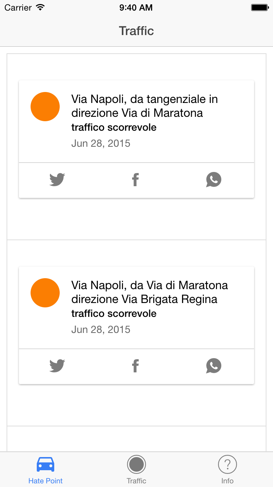
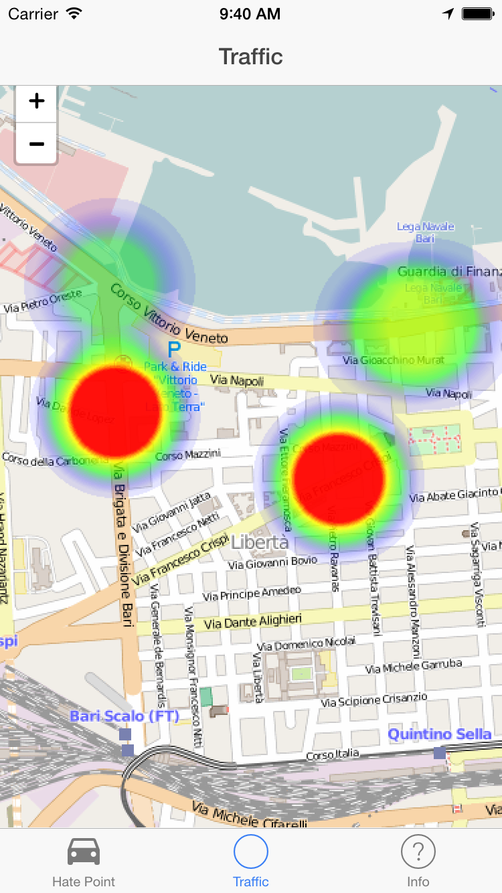

# Hate Traffic

App per il monitoraggio del traffico urbano della città di Bari.
Dalla posizione del dispositivo, visualizza su una mappa le zone di traffico "calde" della città, con maggior traffico urbano.

## Heat Point

## Heat Map

## OpenDATA
I dati appartengono al servizio di [pubblicazione delle informazioni](http://bari.opendata.planetek.it/traffico/v1.0/), alfanumeriche e cartografiche, relative al livello di congestione del traffico realizzato nell'ambito del progetto [Semina](http://www.planetek.it/progetti/semina_sistemi_evoluti_per_la_mobilità_intelligente_in_network_urbani_agili)

## Riferimento

La App è stata sviluppata con [IonicFramework](http://www.ionicframework.com) 
Post sul blog dello sviluppatore, [CO2, Un naso elettronico sul vostro smartphone](http://giuseppezileni.github.io/app/2015/06/20/co2.html)

## Autore
* [OpenPuglia](http://www.openpuglia.org)
* [Giuseppe Zileni](http://giuseppezileni.github.io) | [twitter](http://www.twitter.com/gzileni) | [linkedin](https://it.linkedin.com/in/giuseppezileni)

## Support

